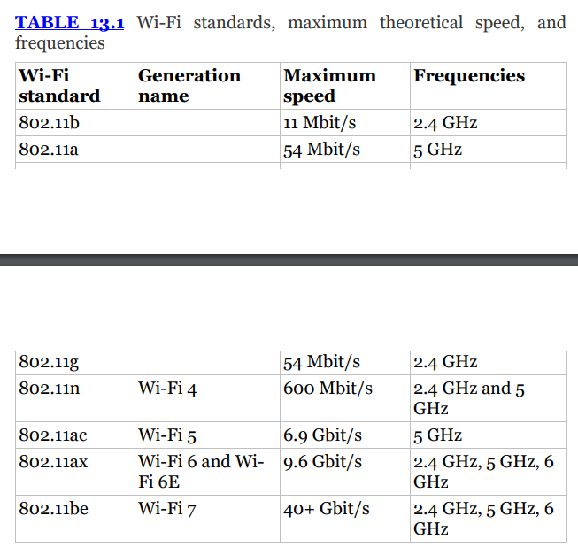
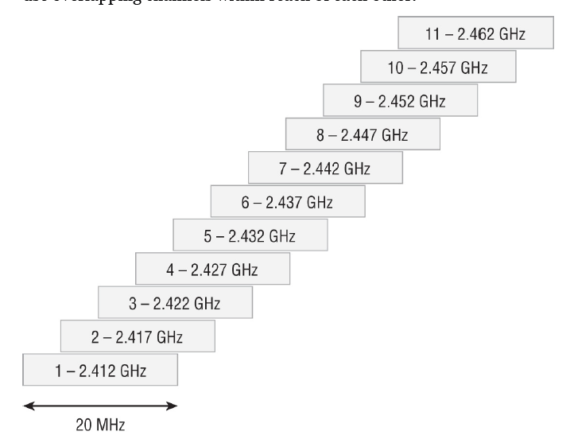

## wireless and mobile security

- connection methods
	- cellular
		- towers cover geographic areas (divided into cells)
		- 5G requires more antenna density but has more bandwidth and throughput
		- provided by cell carrier, so security, management, and control are outside of your org 
	- wifi
		- relies on 2.4GHz and 5GHz radio bands and uses multiple channels within those bands to allow multiple networks to coexist 
		- 
		- wifi protocols (like WPA2 and WPA3) provide security and functionality for security
		- ad hoc mode:
			- devices can talk to each other directly
		- infrastructure mode:
			- traffic goes through a base station, or access point
		- wifi uses SSIDs for a network name, which can be broadcast or kept private
	- bluetooth
		- in 2.4GHz range 
		- used for low power, short range connections w/o high bandwidth needs 
		- connecting in point to point rather than client server model 
		- 4 security modes
			- mode 1: no security
			- mode 2: service level enforced security (encryption w/ unauthenticated pairing)
			- mode 3: link level enforced security (authenticated pairing w/ encryption)
			- mode 4: standard pairing with Security Simple Pairing (SSP)
		- bluetooth does have encryption but relies on the PIN from both devices 
	- RFID
		- uses short range tags and a receiver to exchange info 
		- tag types
			- active: have their own power source and always send signals to be read 
			- semi-active: have a battery to power their circuits but are activated by the reader
			- passive: entirely powered by the reader
		- they use 1 of 3 frequency ranges 
			- low frequency
				- used for short range, low power tags 
				- usually for entry access and id purposes 
			- high frequency
				- longer readable range (up to 1 meter), can communicate faster
			- ultra high frequency
				- longest range, fastest to read
	- GPS
		- uses constellation of satellites that send out GPS signals, which are received by a GPS receiver
		- helps position devices to within a foot of their actual position
		- also provides consistent time signal
		- usually refers to US GPS system, but there's also Russian GLONASS system and smaller regional systems
		- GPS signals can be jammed or spoofed
	- NFC
		- short range communication, like google pay
	- Infrared
		- only work in line of sight 
- wireless network models 
	- 4 major connection models
		- point to point
			- connects two nodes, transmissions can only be received by the endpoints
		- point to multipoint
			- many nodes receive info sent by a node
		- mesh
		- broadcast
			- send out information on many nodes, don't care about receiving a response 
			- ex: GPS, radio
- attacks against wireless networks and devices
	- evil twins and rogue access pointers
		- evil twin: malicious, illegitimate access point that appears to be a trusted network 
			- if someone connects to the evil twin, the victim's traffic will be captured 
		- rogue access points: APs added to your network (intentional or unintentional)
			- once connected to your network, they can offer a point of entry to attackers 
	- bluetooth attacks
		- bluejacking
			- sends unsolicited messages to bluetooth enabled devices
		- bluesnarfing
			- unauthorized access to a bluetooth device, usually gathering info like contact lists or other details the device contains 
	- RF and protocol attacks 
		- disassociation: when a device disconnects from an AP 
			- to force disassociation, they can send a deauthentication frame, which can be send to the AP by spoofing the victim's wireless MAC address
			- when received, the AP disassociates the device 
			- since management frames on WPA2 networks aren't encrypted, it's pretty easy to conduct this attack 
				- however, WPA3 encrypts management frames
		- jamming: blocking traffic in a range or frequency
	-   sideloading and jailbreaks
		- sideloading: transferring files to a mobile device to install apps outside of official app store
		- jailbreaking: taking advantage of vulns in a mobile device's OS for a privilege escalation and root the system, providing the user with more access 
- designing a network
	- site survey: moving through facility to determine existing networks and look at location options for access points 
		- site survey tools test wireless signal as you walk to build a heatmap 
	- determine which channels your AP will use 
		- in 2.4GHz band, which channel is 20 MHz wide, with a 5 MHz space between 
		- there are 11 channels available for use; in most cases, use channels 1, 6, and 11 to avoid overlap 
		- 
		- overlaps can cause interference with each other 
		- many APs will automatically select the best channel when deployed 
- controller and access point security
	- WLAN controllers manage access points and wireless network 
		- they provide extra monitoring, software-defined wireless networks, and can provide blended wifi / 5g roaming
		- can be hardware, cloud service, or VM 
	- ensure that:
		- admin interfaces are on isolated VLANS 
		- monitoring and logging are on 
- wifi security standards
	- WPA2 
		- has 2 major usage modes: 
			- WPA2-Personal (WPA2-PSK)
				- uses a preshared key (PSK = preshared key)
				- allows clients to auth w/o auth server infrastructure
			- WPA2-Enterprise
				- relies on RADIUS auth server as part of a 802.1X implementation for auth
				- users have unique credentials and can be individually identified 
		- uses CCMP (counter mode cipher block chaining message authentication code protocol)
			- CCMP uses AES encryption
			- provides confidentiality, auth, and access control capabilities 
			- has user auth but not network auth 
	- WPA3
		- improves on WPA2
		- WPA3-Personal
			- provides additional protection for password auth using SAE (simultaneous authentication of equals)
				- SAE replies preshared keys and requires interaction b/wn client and network to validate both sides 
					- slows down brute force attacks
			- provides perfect forward secrecy, ensuring traffic b/wn client and network is secure, even if the client's password has been compromised
				- perfect forward secrecy changes encryption keys on an ongoing basis so an exposed key won't expose the entire communication
		- WPA3-Enterprise 
			- continues to use RADIUS 
			- stronger, authenticated encryption than WPA2
			- has additional controls for deriving / authenticating keys and encrypting network frames 
	- wireless authentication
		- choosing how to provide access to networks
			- open networks 
				- no auth needed
				- no encryption 
			- preshared keys (PSKs) 
				- require a passphrase / key 
				- allows encrypted traffic but does not identify unique users 
			- enterprise auth 
				- relies on a RADIUS server
				- utilizes an Extensible Authentication Protocol (EAP) for auth 
		- wireless auth protocols
			- 802.1X is an IEEE standard for access control
			- in wireless networks, used to integrate with RADIUS servers, allowing enterprise users to auth / gain access to the network 
			- enterprise networks use 802.1X and various versions of EAP 
				- EAP is used by 802.1X as part of authing to a RADIUS server
				- common EAP variants:
					- protected EAP (PEAP)
						- auths servers with certificate
						- wraps EAP with TLS tunnel for security
						- devices on the network use unique encryption keys 
						- temporal key integrity protocol (TKIP) is implemented to replace keys regularly
					- EAP-flexible authentication via secure tunneling (EAP-FAST)
						- protocol improving on vulns in Lightweight EAP (LEAP)
						- provides faster reauth when devices are roaming 
						- uses a shared secret (symmetric) key for reauth, as PEAP and EAP-TLS are slowed down by public key exchanges
						- can use PSKs or dynamic keys established using public key auth 
					- EAP-TLS 
						- implements certificate-based auth and mutual auth of both device and network 
						- uses certs on both client and network to generate keys 
						- used less frequently bc cert management challenges for deploying and managing certs on a large number of client devices 
					- EAP tunneled TLS (EAP-TTLS)
						- extends EAP-TLS 
						- doesn't require client to have a cert to create a session
						- removes overhead and mgmt of EAP-TLS 
						- can require additional software that PEAP doesn't, although the two do similar things 
						- can provide support for less secure auth mechanisms
			- when orgs want to work together, RADIUS servers can be federated to allow other org's ppl to auth  
				- ex: eduroam
	- managing secure mobile devices
		- mobile device deployment methods
			- questions: 
				- who owns, who chooses, and who pays for device
				- how is the device managed and supported
				- how are data and applications managed, secured, and protected
			- types of devices
				- BYOD
					- control and management heavily based on the user 
					- far less security and oversight for org 
				- CYOD
					- org pays for device + cellular plan; user chooses device
					- support is easier since only a limited number of device types will be encountered
					- security and management is likely to be less standardized
				- COPE
					- device is company owned and managed
					- allows for reasonable personal use on corporate devices for user convenience 
				- fully corporate owned and managed 
					- resemble corporate PCs with a complete control and management suite 
					- least user friendly option
			- VDI (virtual desktop infra) can help secure devices by providing an accessible secure environment
		- hardening mobile devices
			- CIS (center for internet security) has hardening benchmarks
				- www.cisecurity.org/benchmark/google_android
				- www.cisecurity.org/benchmark/apple_ios
			- typical stuff
				- update / patch OS
				- enable remote wipe 
				- automatic screen locks 
				- wipe after excessive passcode failures 
				- turn off connectivity (eg Bluetooth) when not in use 
		- mobile device mgmt
			- usually, mobile device management (MDM) or unified endpoint management (UEM) tools are used 
				- MDM: focus on managing phones / tablets 
				- UEM: manage mobile devices / desktops / laptops on same platform
			- common MDM / UEM features
				- application management
					- deploying apps to all devices
					- limiting which apps can be installed
					- remotely adding / removing / changing apps and their settings
					- monitoring app usage
				- content management (MCM, mobile content management)
					- secures access and control of org files (documents, media)
					- locks business data in a controlled space and controls access
				- remote wipe 
					- can create liability if user owns the device 
				- geolocation / geofencing
					- some orgs may only let you use tablets within corp facility
					- some orgs may wipe device if it leaves facility 
					- help location lost devices 
				- screen locks / password / PIN / biometrics management 
				- context aware auth
					- looks at context like location, hours of use, etc to determine if someone can log in 
				- containerization
					- use a secure container to run apps, store data, etc reduces risk of cross contamination and exposure 
				- storage separation 
					- separate (potentially encrypted) volumes that require specific apps / wrappers / containers to access them 
				- full device encryption (FDE)
					- resists data theft
				- push notifs 
					- can alert users about issues or ask them to perform an action 
					- communicate with someone who found a lost device 
				- monitor for firmware updates / versions 
				- monitor for jailbreaking 
				- control device wireless connectivity (can disable tethering, which wifi networks device can connect to, NFC use)
  
| Type                                       | who owns? | who controls + maintains? | description                                                                                                                                 |
|--------------------------------------------|-----------|---------------------------|---------------------------------------------------------------------------------------------------------------------------------------------|
| BYOD                                       | user      | user                      | user brings their own device; more user freedom and lower cost for org, but greater risk since the org doesn't control or secure the device |
| CYOD (choose your own device)              | org       | org                       | org owns / maintains device, but user can select it                                                                                         |
| COPE (corporate owned, personally enabled) | org       | org                       | corp provided device allowing reasonable personal use while meeting enterprise security + control needs                                     |
| corporate owned                            | org       | org                       | corp owned has greatest control but least flexibility                                                                                       |
