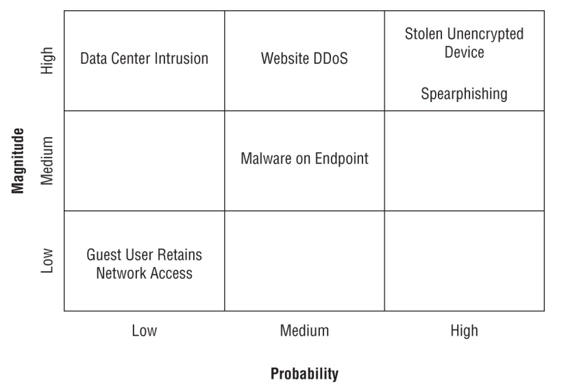

## risk management and privacy

- analyzing risk
    - enterprise risk management (ERM) program: orgs take a formal approach to risk analysis 
        - identify risk, determine severity of risk, adopt risk mgmt strategies to address the risk
- risk identification
	- external risks: risks from outside the org
	-  internal risks: risks from inside the org
	- multiparty risks: risks that impact more than one org
		- ex: power outage in a city
	- legacy systems
	- IP theft
	- software compliance / licensing risk: when org licenses software from a vendor and breaks usage limits exposing the customer to financial / legal risk
- risk assessment 
	- assess risk with: 
		- likelihood of occurrence (probability) 
		- impact
	- risk severity = likelihood * impact
	- different ways to perform risk assessment
		- one time risk assessment
			- risk assessment done at one point in time
		- ad hoc risk assessment
			- conducted in response to a specific event or situation
			- ex: new project, new tech implementation, significant change in business environment 
		- recurring risk assessment
			- performed at regular intervals 
		- continuous risk assessment
			- involve ongoing monitoring and analysis of risks 
			- can include automated systems that constantly scan for new threats
- risk analysis
	- formalized approach to risk prioritization allowing orgs to conduct reviews in a structured manner
	- 2 kinds of methodology
		- quantitative risk analysis: uses numeric data
			1. determine asset value (AV) of asset affected by risk 
				- expressed in monetary value
				- ex: cost to acquire asset, cost to replace, etc
			2. determine likelihood of risk occurring 
				- ARO: annualized rate of occurrence (how many times a risk will happen per year)
			3. determine amt of damage that will occur to the asset if the risk happens
				- EF: exposure factor (the % of the asset expected to be damaged)
			4. calculate single loss expectancy (SLE)
				- amount of financial damage expected each time a risk materialized
			5. annualized loss expectancy (ALE)
				- amount of damage expected from a risk each year (ARO * SLE)
		- qualitative risk analysis: subjective judgments and categories 
			- helps with prioritizing risks
			- 

- managing risk
	- risk management: process of systematically addressing the risks facing an org 
		- provides guidance in prioritizing risks 
		- quantitative risk analyses help determine if impact of a risk justifies the cost 
	- risk mitigation
		- process of applying security controls to reduce probability / magnitude of a risk
	- risk avoidance
		- change business practices to completely eliminate the potential that the risk will happen
	- risk transference
		- shift impact of a risk to another entity 
		- ex: insurance 
	- risk acceptance 
		- "nothing ever happens"
		- some mechanisms can be used 
			- exception: can be granted for a risk if the cost of mitigation is too high 
			- exemption: similar to exception but more formal (might need higher level of approval, often documented)
- risk tracking
	- inherent risk: original level of risk existing before implementing any controls 
	- residual risk: risk that remains after implementing security controls
	- risk appetite: level of risk an org is willing to accept
		- expansionary risk appetite: org willing to take on higher levels of risk for higher rewards
		- neutral risk appetite: balanced approach
		- conservative risk appetites: org avoids high risk, focus on maintaining stability 
	- risk threshold: specific level where a risk becomes unacceptable (quantitative)
	- risk tolerance: ability to withstand risks and continue operations w/o significant impact 
	- key risk indicators (KRI): metrics to measure and provide early warning signals for increasing levels of risk
	- risk owner: individual / entity responsible for managing and monitoring risks 
- risk register
	- tool to track risks facing an org 
	- long document listing risks / causes / impacts / owner etc
	- risk matrix: quick summary of risks for business leaders who are too busy 
- risk reporting
	- communicating status and evolution of risks to stakeholders 
	- regular updates: routine reports w/ status of risks, effectiveness of controls, and recent changes / developments
	- dashboard reporting: visual real time aids 
	- ad hoc reports: reports produced as needed in response to specific events / situations
	- risk trend analysis: 
